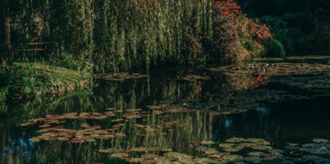
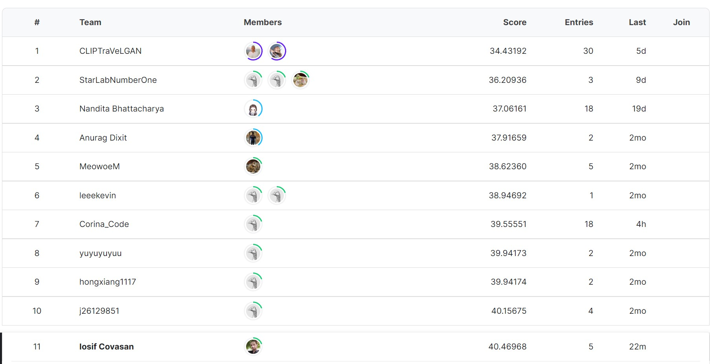
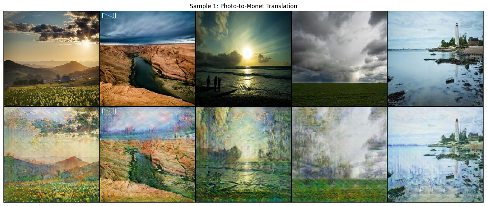
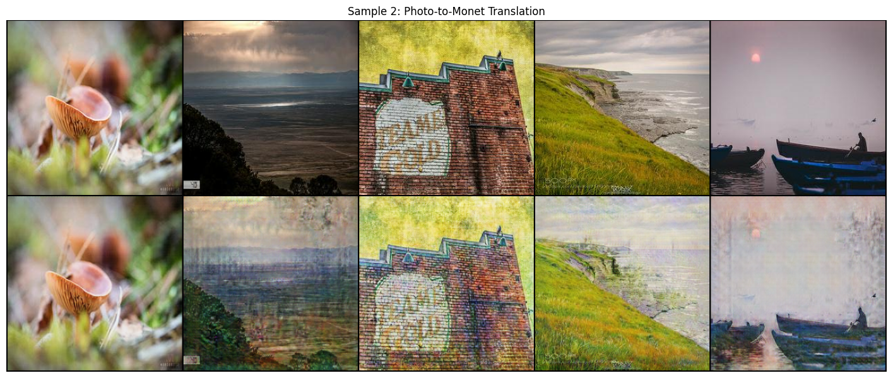
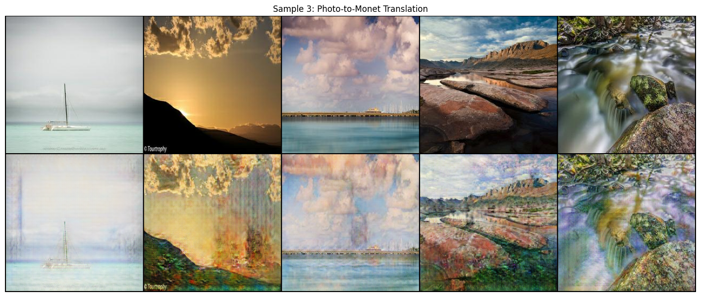
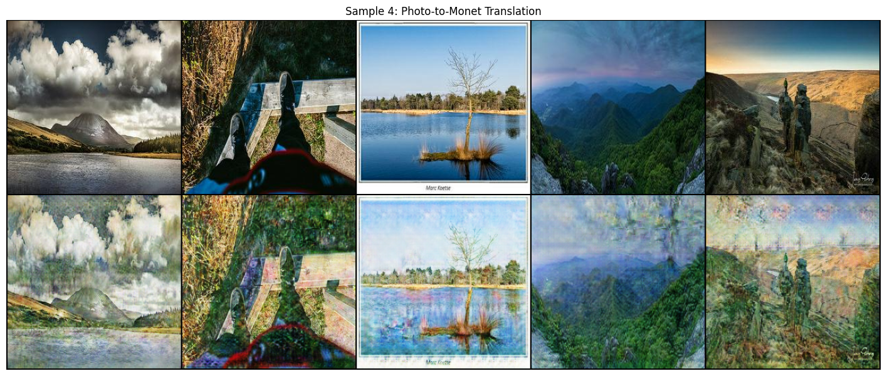
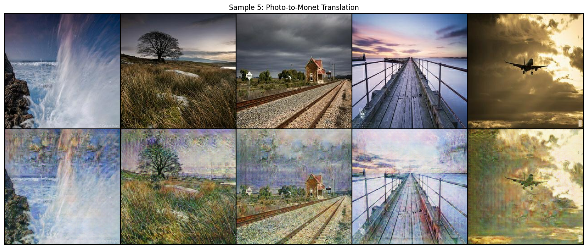

# 🎨 I'm Something of a Painter Myself – CycleGAN Solution

This repository contains my solution for the Kaggle competition **["I'm Something of a Painter Myself"](https://www.kaggle.com/competitions/gan-getting-started)**.  
The task is to generate Monet-style paintings from photos using **Generative Adversarial Networks (GANs)**.  

  

---

## 📌 Approach

My solution builds on the **Cycle-Consistent Adversarial Network (CycleGAN)** architecture, inspired by the [seminal paper](https://arxiv.org/abs/1703.10593).  
Key aspects of the approach include:

- 🖌️ **U-Net Generators** instead of the ResNet baseline, to better capture fine-grained details with limited data (only ~300 Monet paintings).  
- ⏱️ **Training time limited to 5 hours on GPU** (competition constraint).  
- 🔄 **Image augmentation** through scaling, horizontal flipping, and color variations to increase dataset diversity.  
- 📉 **Least-Squares loss** for adversarial training, improving stability compared to the standard negative log-likelihood loss.  

---

## 📊 Results

- **Best MiFID Score:** `40.46968` (on GPU, U-Net generators)  
- **Baseline (Kaggle tutorial model):** `53.76998` (on TPU)  
- **Leaderboard Position:** 11th place (public LB)  

  

---

## 🔬 Ablation Study

Alongside the U-Net model, I tested a **ResNet9-based generator** (similar to the original CycleGAN paper).  
Findings:

- Under strict time limits, **U-Net outperformed ResNet**.  
- With extended training (~50 epochs), **ResNet shows potential for better long-term performance**.  

| Generator Architecture | MiFID Score |
|------------------------|-------------|
| ResNet9                | 50.20616    |
| ResNet6                | 46.75595    |
| **U-Net**              | **40.46968** |

---

  
  
  
  
  

---

## 📄 Full Report

A detailed explanation of the architecture, training strategy, loss functions, and future research directions can be found in the document:  
👉 [**SolutionRaport.pdf**](SolutionRaport.pdf)

---

## 🔗 Resources

- Kaggle Competition: [I'm Something of a Painter Myself](https://www.kaggle.com/competitions/gan-getting-started)  
- Kaggle Notebook (U-Net & ResNet implementations): [Photo-to-Monet using CycleGAN](https://www.kaggle.com/code/iosifcovasan/photo-to-monet-using-cyclegan)  

---
